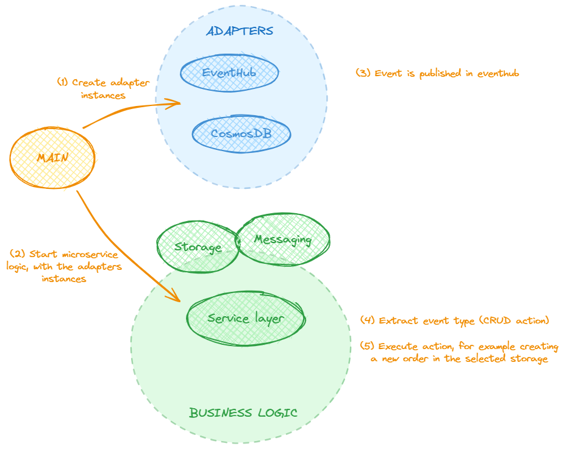

# order-processing
Microservice to process orders

# Build & Deployment

## Creating local docker image

To create a local docker images for each microservice, you can use the following command:

```bash
docker image build -t order-processing -f .\cmd\order-processing\Dockerfile .
```

# Configuration

## Environment Variables

The configuration is managed using Azure App Configuration. The microservice only requires one environment variable with the connection string to the App Config service:
* App configuration: APPCONFIGURATION_CONNECTION_STRING

In the k8s deployment file, this environment variables needs to be set:

```yaml
        env:
        - name: APPCONFIGURATION_CONNECTION_STRING
          valueFrom:
            secretKeyRef:
              name: appconfiguration
              key: appconfigurationconnectionstring
```

And then, the secret needs to be created in the AKS cluster:

```bash
kubectl create secret generic appconfiguration --from-literal=appconfigurationconnectionstring="<connection string>"
```

# Testing

Send a message to the publisher service, you can use curl:

```bash
curl -X POST -H "Content-Type: application/json" -d "{\"Type\": \"create_order\"}" http://<ipaddress>:80/publish
```

# Hexagonal architecture

This microservice utilizes Hexagonal Architecture, also known as Ports and Adapters Pattern, to create a loosely coupled application that is easy to maintain, scale, and test. Here’s a breakdown of the main components:

## Main

The process begins in Main, depicted as an orange circle in the architecture diagram. This is where instances of messaging and storage adapters are created.

## Adapters

The Adapters component, shown as a blue oval in the diagram, contains two types of adapters: EventHub and CosmosDB. These adapters are flexible and interchangeable, allowing the microservice to interact with different types of databases and event systems.
In this case, once an event is published in EventHub, the process moves to the business logic.

## Business Logic

The Business Logic component is represented as a green oval in the diagram. This is where the event type is extracted and the corresponding action is executed. For example, creating a new order in the selected storage.

The arrows in the diagram indicate the flow of processes or data from one component to another. This separation of concerns allows each component to be developed and tested independently, improving the overall robustness and flexibility of the microservice.

It is believed that this Hexagonal Architecture approach makes the microservice more adaptable to changes and easier to maintain. 

